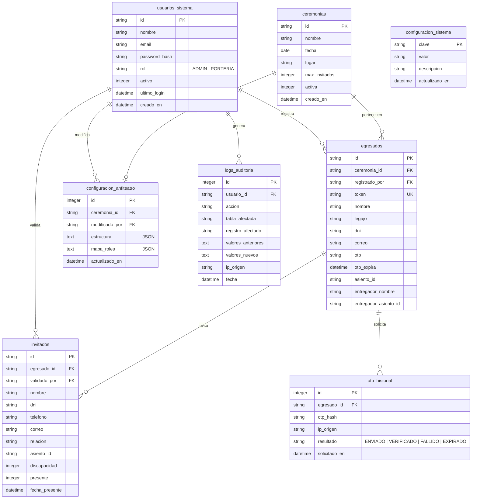

# Diagrama de Relación Entidad (DER) - SiGIC

Este diagrama representa la estructura de la base de datos SQLite utilizada en el sistema.

```mermaid
erDiagram
    usuarios_sistema ||--o{ egresados : "registra"
    usuarios_sistema ||--o{ invitados : "valida"
    usuarios_sistema ||--o{ configuracion_anfiteatro : "modifica"
    usuarios_sistema ||--o{ logs_auditoria : "genera"
    
    ceremonias ||--o{ egresados : "pertenecen"
    ceremonias ||--o| configuracion_anfiteatro : "define estructura"
    
    egresados ||--o{ invitados : "invita"
    egresados ||--o{ otp_historial : "solicita"

    usuarios_sistema {
        string id PK
        string nombre
        string email
        string password_hash
        string rol "ADMIN | PORTERIA"
        integer activo
        datetime ultimo_login
        datetime creado_en
    }

    ceremonias {
        string id PK
        string nombre
        date fecha
        string lugar
        integer max_invitados
        integer activa
        datetime creado_en
    }

    egresados {
        string id PK
        string ceremonia_id FK
        string registrado_por FK
        string token UK
        string nombre
        string legajo
        string dni
        string correo
        string otp
        datetime otp_expira
        string asiento_id
        string entregador_nombre
        string entregador_asiento_id
    }

    invitados {
        string id PK
        string egresado_id FK
        string validado_por FK
        string nombre
        string dni
        string telefono
        string correo
        string relacion
        string asiento_id
        integer discapacidad
        integer presente
        datetime fecha_presente
    }

    configuracion_anfiteatro {
        integer id PK
        string ceremonia_id FK
        string modificado_por FK
        text estructura "JSON"
        text mapa_roles "JSON"
        datetime actualizado_en
    }

    otp_historial {
        integer id PK
        string egresado_id FK
        string otp_hash
        string ip_origen
        string resultado "ENVIADO | VERIFICADO | FALLIDO | EXPIRADO"
        datetime solicitado_en
    }

    logs_auditoria {
        integer id PK
        string usuario_id FK
        string accion
        string tabla_afectada
        string registro_afectado
        text valores_anteriores
        text valores_nuevos
        string ip_origen
        datetime fecha
    }

    configuracion_sistema {
        string clave PK
        string valor
        string descripcion
        datetime actualizado_en
    }
```
