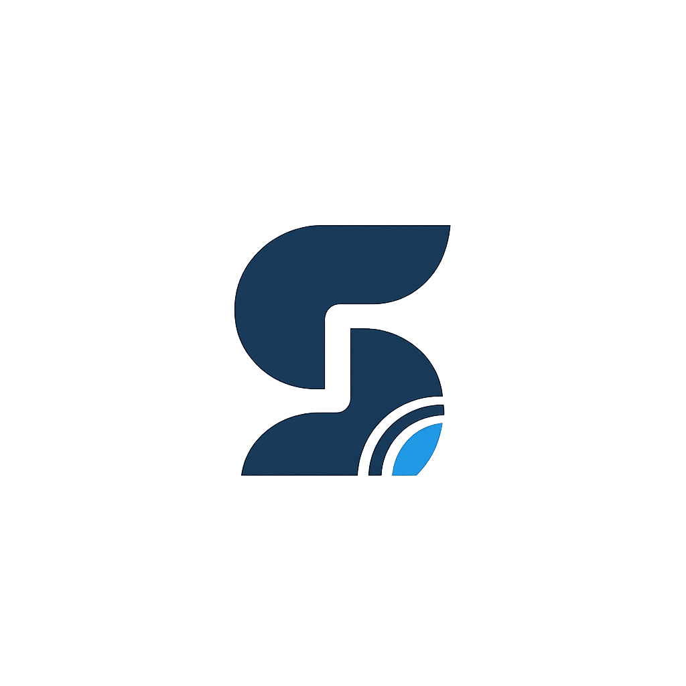

<p align="center">
  
</p>

<h1 align="center">SiGIC</h1>
<p align="center">
  <strong>Sistema de Gestión Integral de Colación y Ceremonias</strong><br>
  <em>Instituto Tecnológico Beltrán — Proyecto Final 2026</em>
</p>

<p align="center">
  
  
  
  
  
</p>

> [!NOTE]
> La plataforma se encuentra actualmente en desarrollo activo.

---

## Descripción

SiGIC es una plataforma integral desarrollada para planificar, coordinar y ejecutar ceremonias de colación de principio a fin. El sistema optimiza el flujo de acreditaciones, distribución de butacas en tiempo real, gestión de acompañantes y control de accesos mediante credenciales digitales con códigos QR, garantizando un evento ágil y seguro.

---

## ¿Qué Resuelve?

El sistema cubre todo el ciclo operativo de un acto institucional:

*   **Ceremonias:** Creación, configuración y activación del evento escolar.
*   **Padrón de Graduados:** Importación masiva de egresados desde planillas de cálculo, altas individuales y edición de datos académicos.
*   **Invitados y Acompañantes:** Sistema autogestionado para que el egresado asigne sus invitados bajo los cupos configurados.
*   **Editor Visual de Anfiteatro:** Distribución de sectores y asignación dinámica de butacas (egresados distinguidos, familiares, autoridades).
*   **Acreditación por QR (Portería):** Escaneo rápido de invitaciones en la entrada y registro de asistencia en tiempo real.
*   **Panel de Monitoreo:** Estadísticas en vivo de ingresos y reportes de presentismo.

---

## Estructura del Proyecto

La arquitectura se divide en la API central (`servidor`), los clientes de interacción (`interfaz/`) y las herramientas operativas de control local (`scripts/`):

```text
SiGIC/
├── codigo/
│   ├── servidor/           # API REST (Node.js + Express) & PostgreSQL
│   │   ├── datos/          # Definición de esquemas y datos iniciales
│   │   ├── rutas/          # Endpoints REST de la aplicación
│   │   ├── middleware/     # Control de seguridad (JWT) y rate-limiting
│   │   ├── servicios/      # Notificaciones (email) y tokens criptográficos
│   │   └── scripts/        # Tareas administrativas de base de datos
│   └── interfaz/
│       ├── web/            # Panel de control administrativo (React + Vite)
│       ├── movil/          # Portal de autogestión de graduados (React + Vite)
│       └── flutter/        # App móvil para control de acceso (Flutter)
├── scripts/                # Panel de Control nativo de Windows (Python)
├── LEEME.md                # Configuración avanzada de seguridad y despliegue
├── README.md               # Este archivo de presentación general
├── CHANGELOG.md            # Historial de versiones y cambios del código
└── .gitignore
```

---

## Seguridad del Sistema

El ecosistema de seguridad de SiGIC fue diseñado bajo estándares de producción:

> [!IMPORTANT]
> **Autenticación con JWT:** Todas las llamadas al backend están protegidas mediante tokens firmados `HS256`. Se eliminaron las cabeceras vulnerables del cliente (como `x-rol`), obligando a que la validación se realice en cada endpoint del servidor.

*   **OTP y Enlaces Seguros:** Los egresados inician sesión con códigos de un solo uso de 6 dígitos o mediante links de invitación únicos basados en hashes criptográficamente seguros (`crypto.randomBytes`).
*   **Control de Tasa (Rate Limiting):** El servidor cuenta con un middleware de control de peticiones en memoria para neutralizar intentos de fuerza bruta en accesos y solicitudes de códigos.
*   **Protección TLS:** Forzamos la encriptación SSL/TLS en las conexiones hacia PostgreSQL (Neon).
*   **Cabeceras HTTP de Producción:** Configuración de cabeceras de prevención (`nosniff`, `X-Frame-Options: DENY`, `Referrer-Policy`) y límite de tamaño en el parser JSON del servidor (1MB).

---

## Puesta en Marcha

### Requisitos Previos
- **Node.js** v18 o superior
- **NPM** (gestor de paquetes de Node)
- **Python** v3.x (opcional, requerido para Control Center en Windows)

### 1. Vía Control Center (Recomendado)
Nuestro panel nativo Fluent para Windows te permite encender todas las terminales y bases de datos en un solo clic:
```bash
python scripts/SiGIC_Control_Center_Pro.py
```

### 2. Arranque Manual de Servicios

*   **Levantar Servidor (API Backend):**
    ```bash
    cd codigo/servidor
    npm install
    npm start
    ```
*   **Levantar Portal Administrativo (Web):**
    ```bash
    cd codigo/interfaz/web
    npm install
    npm run dev
    ```
*   **Levantar Portal Egresados (Móvil):**
    ```bash
    cd codigo/interfaz/movil
    npm install
    npm run dev
    ```

---

## Equipo de Desarrollo

Este proyecto fue desarrollado en el marco de las **Prácticas Profesionalizantes** del **Instituto Tecnológico Beltrán** por:

<table>
  <tr>
    <td align="center">
      <br />
      <sub><b>Cancelo Julian</b></sub>
    </td>
    <td align="center">
      <br />
      <sub><b>Alfonso Alan Alexis</b></sub>
    </td>
    <td align="center">
      <br />
      <sub><b>Contreras V. Sol</b></sub>
    </td>
    <td align="center">
      <br />
      <sub><b>Frassia Matias</b></sub>
    </td>
    <td align="center">
      <br />
      <sub><b>Santillan Luis G.</b></sub>
    </td>
  </tr>
</table>

**Año del Proyecto:** 2026
