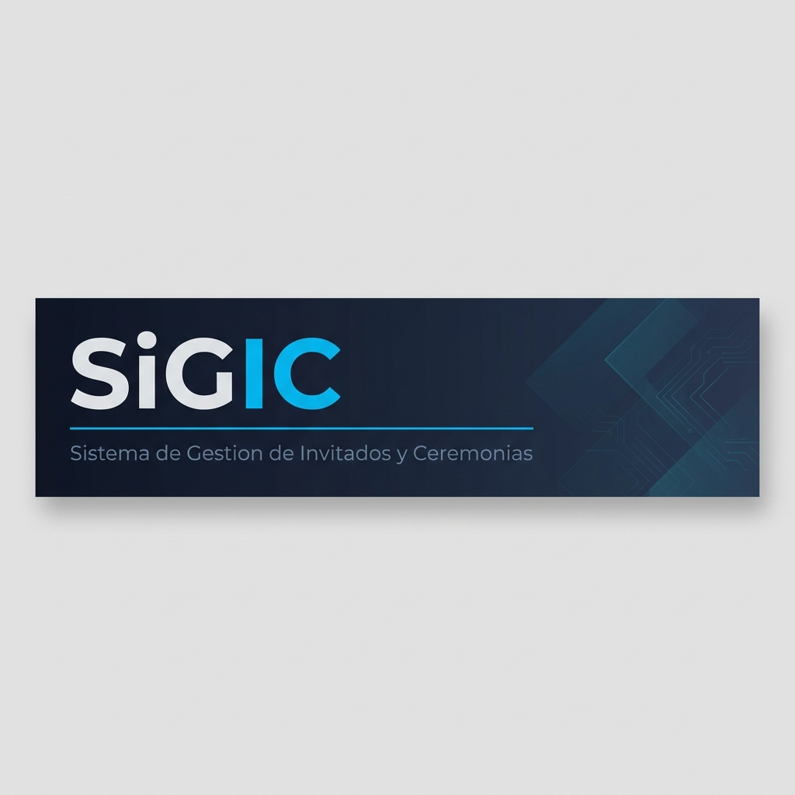

<p align="center">
  
</p>

<p align="center">
  
  
  
  
  
</p>

---

## Acerca del Proyecto

**SiGIC** es una plataforma integral desarrollada para la organizacion, control de acceso y gestion de ubicaciones en ceremonias de graduacion y eventos institucionales masivos.

El sistema permite administrar el ciclo de vida completo de un evento: desde el diseño del anfiteatro y la asignacion de asientos, hasta el registro de invitados y la validacion de credenciales en tiempo real mediante codigos QR.

Este proyecto se destaca por su arquitectura modular, utilizando componentes propios publicados en el registro oficial de NPM como dependencias independientes.

---

## Funcionalidades Principales

| Modulo | Descripcion |
|---|---|
| **Centro de Control** | Aplicacion de escritorio para el despliegue unificado de toda la infraestructura (backend y frontend) en un solo paso. |
| **Gestion de Ceremonias** | Creacion y configuracion de eventos con parametros como fecha, lugar y capacidad maxima de invitados. |
| **Padron de Egresados** | Registro dinamico con soporte para importacion masiva desde archivos Excel y envio de invitaciones por correo electronico. |
| **Editor de Anfiteatro** | Herramienta visual interactiva para disenar la disposicion de asientos y gestionar el aforo por zonas. |
| **Libreria de Asientos** | Motor de renderizado modular publicado como paquete NPM (`@jcancelo/mapa-asientos-sigic`) para la gestion reactiva de ubicaciones. |
| **Control de Acceso** | Modulo mobile optimizado para el escaneo y validacion de credenciales QR en tiempo real durante el evento. |

---

## Arquitectura del Sistema

El proyecto sigue una arquitectura de tres capas con separacion clara de responsabilidades:

```text
SiGIC/
├── frontend/                        # Interfaz de usuario (React + Vite + TailwindCSS)
│   ├── src/
│   │   ├── componentes/             # Componentes atomicos y de UI
│   │   ├── paginas/                 # Vistas principales del panel
│   │   ├── servicios/               # Capa de integracion con la API
│   │   ├── layouts/                 # Estructuras de pagina (Auth, Panel)
│   │   └── utilidades/              # Funciones auxiliares
│   └── public/                      # Assets estaticos (logos, plantillas QR)
│
├── backend/                         # Servidor API REST (Node.js + Express)
│   ├── rutas/                       # Endpoints organizados por recurso
│   ├── servicios/                   # Logica de negocio (email, autenticacion)
│   ├── datos/                       # Seeds y datos maestros
│   └── db.js                        # Capa de acceso a datos (SQLite)
│
├── mobile/                          # Modulo de Control de Acceso
│
├── dist/                            # Distribucion del Centro de Control
└── SiGIC_Control_Center_Pro.py      # Lanzador Maestro del sistema
```

---

## Stack Tecnologico

| Capa | Tecnologias |
|---|---|
| **Frontend** | React 19, Vite 8, TailwindCSS 4, Lucide Icons |
| **Backend** | Node.js, Express, SQLite, Nodemailer |
| **Librerias Propias** | `@jcancelo/mapa-asientos-sigic` v2.0 (NPM) |
| **Infraestructura** | Python (Centro de Control), QR Code (credenciales) |

---

## Instalacion y Despliegue

### Requisitos Previos

- Node.js v18 o superior
- NPM
- Python 3.x (solo para el Centro de Control)

### Despliegue Automatizado

Ejecutar el Centro de Control para levantar toda la infraestructura:

```bash
python SiGIC_Control_Center_Pro.py
```

### Instalacion Manual

```bash
# Servidor API
cd backend
npm install
npm start

# Interfaz de usuario
cd frontend
npm install
npm run dev
```

---

## Equipo de Desarrollo

Este proyecto ha sido desarrollado como parte de las Practicas Profesionalizantes por un equipo de alumnos que se encuentran cursando el ultimo tramo de la carrera de **Analista de Sistemas** en el **Instituto Tecnologico Beltran (ITB)**.

| Integrante | Rol |
|---|---|
| Alfonso Alan Alexis | Desarrollo |
| Cancelo Julian | Desarrollo / Documentacion |
| Contreras Villalba Sol Heilin | Desarrollo / Documentacion |
| Frassia Matias | Desarrollo |
| Santillan Luis Gabriel | Desarrollo |

**Año:** 2026

---

<p align="center">
  
  <br>
  <sub>Instituto Tecnologico Beltran — Avellaneda, Buenos Aires, Argentina</sub>
</p>
