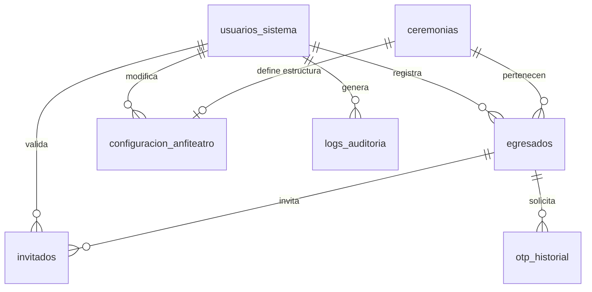

# SiGIC: Informe de Evolución Técnica y Modularización

Este documento resume los avances arquitectónicos realizados en el sistema **SiGIC (Sistema de Gestión de Invitados y Ceremonias)**, destacando la transición de una estructura monolítica a un ecosistema basado en librerías distribuidas.

## 1. Modularización: Librería @jcancelo/mapa-asientos-sigic

El mayor hito técnico ha sido la abstracción del motor de visualización de anfiteatros. Lo que antes era un componente acoplado al proyecto, ahora es una **librería profesional publicada en NPM**.

### Beneficios Arquitectónicos:
*   **Separación de Responsabilidades**: El núcleo del sistema (backend y lógica de ceremonias) queda totalmente desacoplado de la lógica de renderizado visual de asientos.
*   **Distribución mediante NPM**: La librería se gestiona como una dependencia externa, siguiendo los estándares de la industria (versionado semántico 1.1.2).
*   **Encapsulamiento Estético**: La librería empaqueta sus propios estilos optimizados, permitiendo su uso en cualquier proyecto de React sin configuraciones adicionales.

## 2. Optimización y Clean Code
*   **Refactorización de Componentes**: Se simplificó la lógica de las páginas `SeleccionAsientos` y `EditorAnfiteatro`, delegando la complejidad al componente modular.
*   **Saneamiento del Repositorio**: Se reestructuró el historial de Git y se configuró un sistema de exclusiones (`.gitignore`) para garantizar un repositorio limpio, enfocado solo en el código fuente y activos necesarios.
*   **Documentación Técnica**: Se estandarizó la documentación en español, eliminando elementos informales y adoptando un tono técnico institucional.

## 3. Impacto en el Desarrollo Institucional
Esta metodología no solo resuelve las necesidades actuales del Instituto Beltrán, sino que sienta las bases para futuros desarrollos. La librería creada es un **activo tecnológico reutilizable** por la institución para cualquier otro sistema de gestión de espacios.

---
**Julian Cancelo**
Tecnicatura Superior en Desarrollo de Software
Instituto Tecnológico Beltrán - 2026

## 4. Estructura de Datos (DER)

A continuación se detalla la relación entre las entidades principales del sistema:

