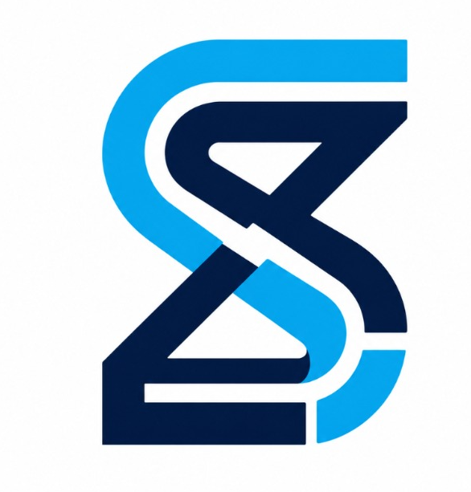

<div align="center">
  

  <h2>SiGIC - Portal Web Administrativo</h2>
  <p>Sistema de Gestión Institucional de Ceremonias — Instituto Tecnológico Beltrán</p>

  
  
  
  
</div>

---

## Descripción

Este es el portal web de administración centralizada de SiGIC. Proporciona una interfaz de escritorio moderna, reactiva y optimizada para los administradores y personal administrativo del Instituto Tecnológico Beltrán. Desde aquí se gestionan las ceremonias, el padrón de alumnos, los docentes, la distribución física del anfiteatro y se realiza el seguimiento en tiempo real del evento.

---

## Módulos Principales

*   **Panel de Control**: Vista unificada con indicadores del estado del servidor, clima y accesos rápidos de administración.
*   **Gestión de Ceremonias**: Planificación, creación y activación de colaciones.
*   **Padrón de Egresados y Profesores**: Importación masiva desde planillas de cálculo, altas manuales y envío automático de invitaciones/credenciales por correo electrónico.
*   **Editor Visual de Anfiteatro**: Diseñador interactivo en pantalla para mapear filas y butacas libres, asignando asientos especiales para autoridades y egresados distinguidos.
*   **Control y Métricas**: Monitoreo de ingreso en portería con actualización instantánea de estadísticas.

---

## Estructura del Proyecto

```text
codigo/interfaz/web/
├── public/              # Assets estáticos e iconos del portal administrativo
└── src/
    ├── componentes/     # Componentes de gestión, formularios y modales de importación
    ├── datos/           # Parámetros maestros y esquemas de vistas
    ├── layouts/         # Estructuras de la aplicación (Autenticación, Dashboard)
    ├── paginas/         # Pantallas principales (Gestión de Graduados, Asistente de Configuración)
    ├── servicios/       # Integración cliente-servidor con la API
    └── utilidades/      # Formateadores, validadores de contraseñas e integraciones
```

---

## Desarrollo

### Requisitos Previos
- Node.js (versión recomendada LTS)
- NPM o Yarn

### Comandos
```bash
# Instalar dependencias
npm install

# Iniciar servidor de desarrollo
npm run dev

# Compilar para producción
npm run build

# Previsualizar build localmente
npm run preview
```

---

## Estética y Diseño
El portal de administración utiliza una estética moderna con efectos semi-transparentes (Glassmorphism):
- Panel estructurado optimizado para pantallas medianas y grandes.
- Paleta de colores sobria alineada a la identidad del Instituto Beltrán.
- Retroalimentación mediante micro-animaciones dinámicas y transiciones suaves.

---

<div align="center">
  <sub>Desarrollado para el Instituto Tecnológico Beltrán</sub>
</div>
