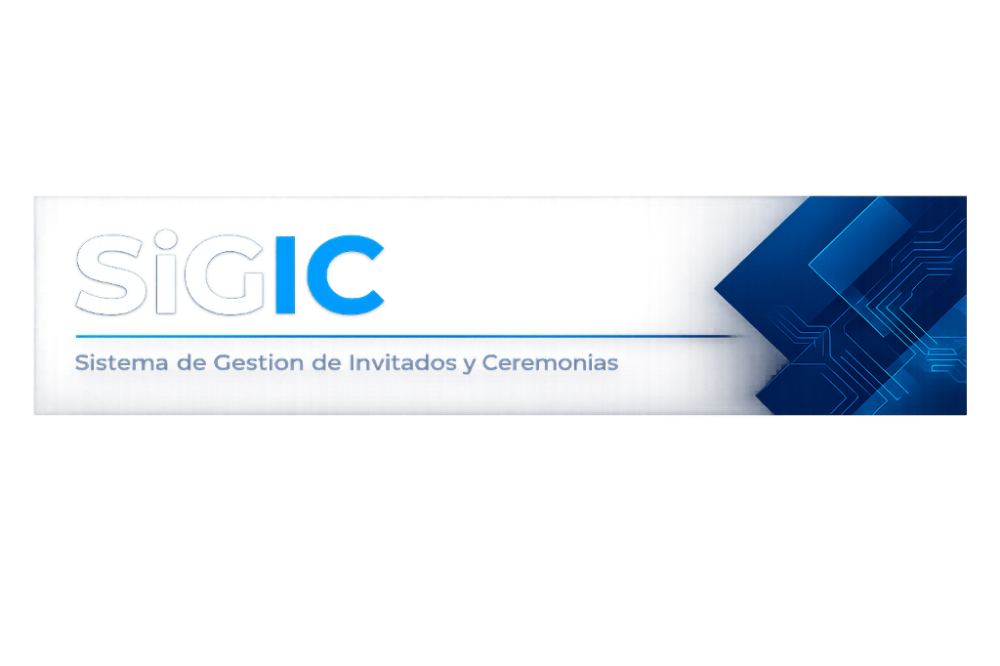

<div align="center">
  

  <h2>SiGIC - Frontend</h2>
  <p>Sistema de Gestión Institucional de Ceremonias — Instituto Tecnológico Beltrán</p>

  
  
  
  
</div>

---

## Descripción

SiGIC es una plataforma integral diseñada para la gestión profesional de actos de colación y ceremonias institucionales. Este frontend proporciona una interfaz moderna, reactiva y optimizada para la administración de invitados, diseño de anfiteatros y control de acceso.

---

## Módulos Principales

*   **Panel de Control**: Vista general con estadísticas en tiempo real, clima y accesos rápidos.
*   **Gestión de Ceremonias**: Creación y configuración de eventos específicos.
*   **Administración de Invitados**: Registro, importación y seguimiento de asistentes.
*   **Editor de Anfiteatro**: Herramienta visual para diseñar la disposición de asientos y asignar roles.
*   **Selección de Asientos**: Interfaz interactiva para que los egresados elijan su ubicación.
*   **Control de Ingreso**: Sistema de validación de credenciales mediante códigos QR.

---

## Estructura del Proyecto

```text
frontend/
├── public/              # Assets estáticos y plantillas (QR, logos)
└── src/
    ├── componentes/     # Componentes atómicos y específicos del panel
    ├── datos/           # Configuraciones y datos maestros
    ├── layouts/         # Estructuras base de la aplicación (Auth, Panel)
    ├── paginas/         # Vistas principales (Login, Dashboard, Editores)
    ├── servicios/       # Integración con la API Backend
    └── utilidades/      # Funciones de apoyo (Formateo, Clima, Validaciones)
```

---

## Desarrollo

### Requisitos Previos
- Node.js (versión recomendada LTS)
- NPM o Yarn

### Comandos
```bash
# Instalar dependencias
npm install

# Iniciar servidor de desarrollo
npm run dev

# Compilar para producción
npm run build

# Previsualizar build localmente
npm run preview
```

---

## Estética y Diseño
El proyecto utiliza una estética Glassmorphic moderna con:
- Micro-animaciones para mejorar la experiencia de usuario.
- Diseño responsivo adaptado a tablets y laptops.
- Tipografía limpia y paleta de colores institucional.

---

<div align="center">
  <sub>Desarrollado para el Instituto Tecnológico Beltrán</sub>
</div>
